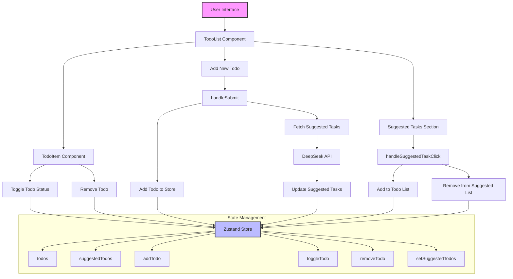

## Application Flow Description

1. **User Interface**
   - Main entry point of the application
   - Renders TodoList component

2. **TodoList Component**
   - Manages the main todo list interface
   - Handles form submission for new todos
   - Displays suggested tasks
   - Renders individual TodoItem components

3. **TodoItem Component**
   - Displays individual todo items
   - Handles todo status toggling
   - Handles todo deletion

4. **State Management (Zustand Store)**
   - Manages todos array
   - Manages suggestedTodos array
   - Provides actions:
     - addTodo
     - toggleTodo
     - removeTodo
     - setSuggestedTodos

5. **DeepSeek API Integration**
   - Fetches suggested tasks when new todo is added
   - Updates suggested tasks in the store

6. **User Interactions**
   - Adding new todos
   - Toggling todo completion
   - Removing todos
   - Adding suggested tasks
   - Removing suggested tasks after selection 